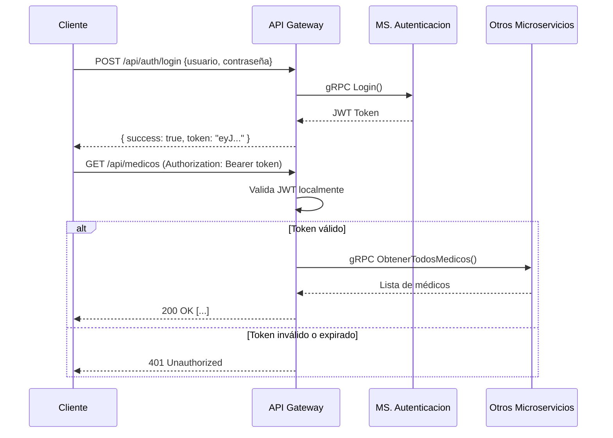

<h1 align="center">
  🏥 Sistema de Gestión Hospitalaria — Backend
</h1>

<p align="center">
  Arquitectura de microservicios para la gestión integral de hospitales y clínicas, construida con <strong>.NET 9</strong>, <strong>gRPC</strong> y <strong>MySQL</strong>, orquestada con <strong>Docker Compose</strong>.
</p>

<p align="center">
  
  
  
  
  
  
</p>

<p align="center">
  
  
  
</p>

---

## 📋 Tabla de Contenidos

- [Descripción General](#-descripción-general)
- [Arquitectura del Sistema](#-arquitectura-del-sistema)
- [Microservicios](#-microservicios)
- [Stack Tecnológico](#-stack-tecnológico)
- [Estructura del Repositorio](#-estructura-del-repositorio)
- [Bases de Datos](#-bases-de-datos)
- [Puertos y Comunicación](#-puertos-y-comunicación)
- [Requisitos Previos](#-requisitos-previos)
- [Instalación y Ejecución](#-instalación-y-ejecución)
- [API Endpoints](#-api-endpoints)
- [Autenticación JWT](#-autenticación-jwt)
- [Seguridad](#-seguridad)
- [Contribuciones](#-contribuciones)

---

## 🌐 Descripción General

El **Sistema de Gestión Hospitalaria** es un backend distribuido diseñado para gestionar de forma centralizada las operaciones de un hospital y sus clínicas de extensión. Implementa una **arquitectura de microservicios desacoplados** que se comunican entre sí a través del protocolo **gRPC**, exponiendo una **API REST unificada** al mundo exterior a través de un **API Gateway**.

El sistema está pensado para escenarios reales de atención médica, incluyendo:

- 🔐 Autenticación segura de personal médico y administrativo
- 🏥 Administración centralizada de médicos, pacientes y especialidades
- 📋 Registro y consulta de consultas médicas
- 📊 Generación de reportes y estadísticas clínicas
- 🌍 Soporte para múltiples sedes (Hospital Central + Clínicas de Extensión)

---

## 🏗️ Arquitectura del Sistema

```
                          ┌─────────────────────────────┐
                          │         CLIENTES             │
                          │  (React / Angular / Postman) │
                          └──────────────┬──────────────┘
                                         │  HTTP/REST + JWT
                                         ▼
                          ┌─────────────────────────────┐
                          │        API GATEWAY           │
                          │     localhost:5088           │
                          │  • Autenticación JWT         │
                          │  • Enrutamiento              │
                          │  • CORS                      │
                          │  • Swagger UI                │
                          └──┬──────────┬──────────┬────┘
                             │  gRPC    │  gRPC    │ gRPC
                ┌────────────▼──┐  ┌────▼────────┐  ┌▼────────────────┐
                │  MS. Auth     │  │  MS. Admin  │  │  MS. Consultas  │
                │  :5101        │  │  :5100      │  │  :5105          │
                │               │  │             │  │                 │
                │  • Login      │  │  • Médicos  │  │  • Consultas    │
                │  • JWT gen.   │  │  • Pacientes│  │  • Estadísticas │
                │  • Recovery   │  │  • Especial.│  │  • Reportes     │
                │  • Validación │  │  • Usuarios │  │                 │
                └───────┬───────┘  └──────┬──────┘  └────────┬────────┘
                        │                 │                   │
                        ▼                 ▼                   ▼
              ┌─────────────────┐ ┌──────────────────┐ ┌─────────────────┐
              │  MySQL hosp_    │ │  MySQL hosp_     │ │  MySQL ext1 /   │
              │  central        │ │  central         │ │  extension_1    │
              │  (auth, users)  │ │  (médicos, etc.) │ │  (consultas)    │
              │  :33070         │ │  :33070          │ │  :33061/:33062  │
              └─────────────────┘ └──────────────────┘ └─────────────────┘
```

### Patrón de Comunicación

| Canal | Protocolo | Uso |
|-------|-----------|-----|
| Cliente → API Gateway | HTTP/REST + JWT | Peticiones externas |
| API Gateway → Microservicios | gRPC (HTTP/2) | Comunicación interna |
| Microservicio.Consultas → Microservicio.Administracion | gRPC | Datos de médicos/pacientes |

---

## 🧩 Microservicios

### 🌐 API Gateway — `puerto 5088`

Punto de entrada único para todos los clientes. Traduce peticiones HTTP/REST a llamadas gRPC hacia los microservicios, gestiona la autenticación JWT y documenta la API con Swagger.

**Controladores REST disponibles:**

| Controlador | Ruta base | Descripción |
|-------------|-----------|-------------|
| `AuthController` | `/api/auth` | Login, validación de token, recuperación de contraseña |
| `MedicosController` | `/api/medicos` | CRUD de médicos |
| `PacientesController` | `/api/pacientes` | CRUD de pacientes |
| `ConsultasController` | `/api/consultas` | Registro y consulta de consultas médicas |
| `EspecialidadesController` | `/api/especialidades` | Gestión de especialidades médicas |
| `UsuariosController` | `/api/usuarios` | Gestión de usuarios del sistema |
| `ReportesController` | `/api/reportes` | Reportes por médico, estadísticas, médicos disponibles |

---

### 🔐 Microservicio.Autenticacion — `puerto 5101`

Microservicio gRPC responsable de toda la lógica de autenticación y seguridad.

**Servicios gRPC expuestos:**

```protobuf
service AuthService {
  rpc Login (LoginRequest) returns (LoginReply);
  rpc ValidateToken (TokenRequest) returns (TokenReply);
  rpc SendPasswordByEmail (PasswordRecoveryRequest) returns (PasswordRecoveryReply);
}
```

**Características:**
- Generación y validación de tokens **JWT** (HS256)
- Autenticación de usuarios por nombre de usuario y contraseña
- **Recuperación de contraseña** por correo electrónico (SMTP/Gmail)
- Integrado con la base de datos `hosp_central` (MySQL)

---

### 🏥 Microservicio.Administracion — `puerto 5100`

Microservicio gRPC central para la gestión del personal y recursos hospitalarios. Conecta con múltiples bases de datos (hospital central y extensiones).

**Servicios gRPC expuestos:**

| Servicio | Operaciones |
|----------|-------------|
| `MedicosService` | ObtenerTodos, ObtenerPorId, Crear, Actualizar, Eliminar |
| `PacientesService` | ObtenerTodos, ObtenerPorId, Crear, Actualizar, Eliminar |
| `EspecialidadesService` | ObtenerTodas, ObtenerPorId |
| `UsuariosService` | Gestión completa de usuarios del sistema |

**Modelos de datos:**
- `Empleado` (médicos y personal)
- `Especialidad`
- `CentroMedico`
- `TipoEmpleado`
- `Usuario`
- `Paciente`

---

### 📋 Microservicio.Consultas — `puerto 5105`

Microservicio gRPC dedicado al registro y análisis de consultas médicas. Consume activamente los servicios de `Microservicio.Administracion` para enriquecer la información de médicos y pacientes.

**Servicios gRPC expuestos:**

| Servicio | Operaciones |
|----------|-------------|
| `ConsultasService` | Registrar, Obtener, Filtrar, Reportes estadísticos |

**Características:**
- Soporte para múltiples sedes (factory pattern por centro)
- Generación de reportes por médico con filtros avanzados
- Estadísticas de consultas por período y especialidad
- Inter-comunicación gRPC con `MedicosService` y `PacientesService`

---

## 🛠️ Stack Tecnológico

| Categoría | Tecnología | Versión |
|-----------|-----------|---------|
| Framework | ASP.NET Core | 9.0 |
| Protocolo RPC | gRPC + Protocol Buffers | 2.65.0 |
| ORM | Entity Framework Core | 9.0 |
| Base de datos | MySQL | 8.0 |
| Driver MySQL | Pomelo.EntityFrameworkCore.MySql | 9.0.0 |
| Autenticación | JWT Bearer (HS256) | 9.0.0 |
| Documentación API | Swagger / Swashbuckle | 7.2.0 |
| Contenedores | Docker + Docker Compose | — |
| Notificaciones | SMTP (Gmail) | — |
| Reflexión gRPC | Grpc.AspNetCore.Server.Reflection | — |

---

## 📁 Estructura del Repositorio

```
GestionHospitalariaBackend/
│
├── 📄 GestionHospitalaria.sln              # Solución .NET
├── 📄 docker-compose.yml                   # Orquestación de contenedores
├── 📄 .dockerignore
│
├── 📂 ApiGateway/                          # Punto de entrada REST
│   ├── Controllers/                        # 8 controladores HTTP
│   ├── Middleware/                         # Validación JWT personalizada
│   ├── Models/                             # DTOs de request/response
│   ├── Protos/                             # auth.proto (cliente)
│   ├── Program.cs
│   ├── Dockerfile
│   └── appsettings.json
│
├── 📂 Microservicio.Autenticacion/         # Auth & JWT
│   ├── Data/                               # DbContext (hosp_central)
│   ├── Models/                             # Usuario, Empleado, Especialidad...
│   ├── Services/                           # AuthService, EmailService
│   ├── Protos/                             # auth.proto, greet.proto
│   ├── Utils/
│   ├── Program.cs
│   └── Dockerfile
│
├── 📂 Microservicio.Administracion/        # Gestión de recursos
│   ├── Data/                               # DbContexts (central + extensiones)
│   ├── Models/                             # Empleado, Paciente, Especialidad...
│   ├── Services/                           # Implementaciones gRPC
│   ├── Protos/                             # medicos, pacientes, especialidades...
│   ├── Program.cs
│   └── Dockerfile
│
├── 📂 Microservicio.Consultas/             # Consultas médicas
│   ├── Data/                               # DbContext con factory multicentro
│   ├── Models/                             # ConsultaMedica
│   ├── Services/                           # ConsultasServiceImpl
│   ├── Protos/                             # consultas, medicos, pacientes
│   ├── Program.cs
│   └── Dockerfile
│
└── 📂 docker/
    └── mysql-init/                         # Scripts SQL de inicialización
        ├── mysql_hosp/
        ├── mysql_ext1/
        ├── mysql_ext2/
        ├── mysql_adm/
        └── mysql_cons/
```

---

## 🗄️ Bases de Datos

El sistema utiliza una arquitectura **multi-base de datos** para separar los datos por dominio y sede:

| Contenedor | Base de datos | Puerto host | Uso |
|------------|---------------|-------------|-----|
| `mysql_hosp` | `hosp_central` | `33070` | Hospital Central (usuarios, médicos, especialidades) |
| `mysql_ext1` | `extension_1` | `33061` | Clínica Extensión — Guayaquil (consultas, pacientes) |
| `mysql_ext2` | `extension_2` | `33062` | Clínica Extensión — Cuenca (consultas, pacientes) |

> Los scripts de inicialización de esquema y datos semilla se encuentran en `docker/mysql-init/`.

---

## 🔌 Puertos y Comunicación

```
┌────────────────────────────────────────────────────────────────┐
│                        HOST MACHINE                            │
│                                                                │
│  API Gateway          :5088  ← HTTP/REST (clientes externos)  │
│  MS. Administracion   :5100  ← gRPC interno                   │
│  MS. Autenticacion    :5101  ← gRPC interno                   │
│  MS. Consultas        :5105  ← gRPC interno                   │
│                                                                │
│  MySQL hosp_central   :33070 ← Acceso directo (desarrollo)    │
│  MySQL extension_1    :33061 ← Acceso directo (desarrollo)    │
│  MySQL extension_2    :33062 ← Acceso directo (desarrollo)    │
│                                                                │
│  Swagger UI     http://localhost:5088/swagger                  │
└────────────────────────────────────────────────────────────────┘
```

---

## ✅ Requisitos Previos

Asegúrate de tener instalado lo siguiente antes de comenzar:

| Herramienta | Versión mínima | Enlace |
|------------|----------------|--------|
| .NET SDK | 9.0 | [descargar](https://dotnet.microsoft.com/download) |
| Docker Desktop | 24.x | [descargar](https://www.docker.com/products/docker-desktop) |
| Docker Compose | 2.x (incluido con Docker Desktop) | — |
| Git | 2.x | [descargar](https://git-scm.com/) |

---

## 🚀 Instalación y Ejecución

### 1. Clonar el repositorio

```bash
git clone https://github.com/GrupoDistribuidas/GestionHospitalariaBackend.git
cd GestionHospitalariaBackend
git checkout develop
```

### 2. Levantar todo el sistema con Docker Compose

```bash
docker-compose up --build
```

Esto levantará **todos los servicios** automáticamente:
- 3 instancias de MySQL con sus esquemas inicializados
- Los 3 microservicios (Autenticacion, Administracion, Consultas)
- El API Gateway

> ⏱️ La primera ejecución puede tardar unos minutos mientras se descargan las imágenes base y se compilan los proyectos.

### 3. Verificar que los servicios están activos

```bash
# Estado general del API Gateway
curl http://localhost:5088/health

# Swagger UI (en el navegador)
start http://localhost:5088/swagger
```

### 4. Ejecución en modo desarrollo (sin Docker)

Si prefieres ejecutar los servicios individualmente para desarrollo:

```bash
# Terminal 1 — Microservicio Autenticacion
cd Microservicio.Autenticacion
dotnet run
# → gRPC en http://localhost:5101

# Terminal 2 — Microservicio Administracion
cd Microservicio.Administracion
dotnet run
# → gRPC en http://localhost:5100

# Terminal 3 — Microservicio Consultas
cd Microservicio.Consultas
dotnet run
# → gRPC en http://localhost:5105

# Terminal 4 — API Gateway
cd ApiGateway
dotnet run
# → REST/HTTP en http://localhost:5088
```

> ⚠️ En modo desarrollo, actualiza las cadenas de conexión en `appsettings.Development.json` de cada proyecto para apuntar a tu MySQL local.

---

## 📚 API Endpoints

Todos los endpoints (excepto los de autenticación) requieren token JWT en el header:
```
Authorization: Bearer <tu-token-jwt>
```

### 🔐 Autenticación — `/api/auth`

| Método | Endpoint | Auth | Descripción |
|--------|----------|------|-------------|
| `POST` | `/api/auth/login` | ❌ | Iniciar sesión y obtener token JWT |
| `POST` | `/api/auth/validate-token` | ❌ | Validar un token JWT |
| `POST` | `/api/auth/recover-password` | ❌ | Recuperar contraseña por email |
| `GET` | `/api/auth/health` | ❌ | Estado del controlador |

**Ejemplo — Login:**
```json
POST /api/auth/login
Content-Type: application/json

{
  "nombreUsuario": "admin",
  "contrasena": "admin123"
}
```
```json
// Response 200 OK
{
  "success": true,
  "token": "eyJhbGciOiJIUzI1NiIsInR5cCI6IkpXVCJ9...",
  "message": "Login exitoso"
}
```

---

### 🩺 Médicos — `/api/medicos`

| Método | Endpoint | Descripción |
|--------|----------|-------------|
| `GET` | `/api/medicos` | Listar todos los médicos |
| `GET` | `/api/medicos/{id}` | Obtener médico por ID |
| `POST` | `/api/medicos` | Crear nuevo médico |
| `PUT` | `/api/medicos/{id}` | Actualizar médico |
| `DELETE` | `/api/medicos/{id}` | Eliminar médico |

---

### 👥 Pacientes — `/api/pacientes`

| Método | Endpoint | Descripción |
|--------|----------|-------------|
| `GET` | `/api/pacientes` | Listar todos los pacientes |
| `GET` | `/api/pacientes/{id}` | Obtener paciente por ID |
| `POST` | `/api/pacientes` | Registrar nuevo paciente |
| `PUT` | `/api/pacientes/{id}` | Actualizar datos del paciente |
| `DELETE` | `/api/pacientes/{id}` | Eliminar paciente |

---

### 📋 Consultas Médicas — `/api/consultas`

| Método | Endpoint | Descripción |
|--------|----------|-------------|
| `GET` | `/api/consultas` | Listar consultas |
| `POST` | `/api/consultas` | Registrar nueva consulta |
| `GET` | `/api/consultas/{id}` | Obtener consulta específica |

---

### 📊 Reportes — `/api/reportes`

| Método | Endpoint | Descripción |
|--------|----------|-------------|
| `POST` | `/api/reportes/consultas-por-medico` | Reporte de consultas filtradas por médico |
| `POST` | `/api/reportes/estadisticas-consultas` | Estadísticas generales de consultas |
| `GET` | `/api/reportes/medicos-disponibles` | Lista de médicos con especialidad real |

**Ejemplo — Reporte por médico con filtros:**
```json
POST /api/reportes/consultas-por-medico
Authorization: Bearer <token>
Content-Type: application/json

{
  "idMedico": 1,
  "fechaInicio": "2024-01-01",
  "fechaFin": "2024-12-31",
  "motivo": "control",
  "diagnostico": "hipertensión"
}
```

---

### ⚙️ Otros Endpoints

| Módulo | Ruta base | Descripción |
|--------|-----------|-------------|
| Especialidades | `/api/especialidades` | Gestión de especialidades médicas |
| Usuarios | `/api/usuarios` | Gestión de usuarios del sistema |
| Health | `/health` | Estado general del API Gateway |

---

## 🔑 Autenticación JWT

El sistema utiliza **JSON Web Tokens (JWT)** con el algoritmo **HS256** para proteger los endpoints.

### Configuración del token

| Parámetro | Valor |
|-----------|-------|
| Algoritmo | HS256 |
| Issuer | `Microservicio.Autenticacion` |
| Audience | `ApiGateway` |
| Clock Skew | 0 (sin tolerancia) |

### Flujo completo



### Endpoints públicos (sin autenticación)

- `POST /api/auth/login`
- `POST /api/auth/validate-token`
- `POST /api/auth/recover-password`
- `GET /health`
- `GET /swagger`

---

## 🔒 Seguridad

### CORS
Configurado para permitir acceso desde los frontends más comunes en desarrollo:

```
http://localhost:3000    (React)
http://localhost:4200    (Angular)
http://localhost:5173    (Vite/Vue)
```

### Contraseñas
Las contraseñas de usuario se almacenan con **hash seguro** (no en texto plano).

### Variables de entorno sensibles
En producción, las siguientes configuraciones deben reemplazarse usando secretos reales (variables de entorno, Azure Key Vault, etc.):

| Configuración | Descripción |
|---------------|-------------|
| `Jwt:Key` | Clave secreta para firmar tokens JWT |
| `ConnectionStrings:*` | Credenciales de base de datos |
| `EmailSettings:Password` | Contraseña de la cuenta SMTP |

---

## 🧪 Pruebas

### Swagger UI
```
http://localhost:5088/swagger
```
Disponible en entorno de desarrollo. Permite probar todos los endpoints interactivamente con autenticación JWT integrada.

### VS Code REST Client
Usa el archivo `ApiGateway/ApiGateway.http` para ejecutar peticiones directamente desde VS Code con la extensión REST Client.

### PowerShell

```powershell
# 1. Login
$body = @{ nombreUsuario = "admin"; contrasena = "admin123" } | ConvertTo-Json
$res  = Invoke-RestMethod -Uri "http://localhost:5088/api/auth/login" -Method POST -Body $body -ContentType "application/json"

# 2. Petición autenticada
$headers = @{ Authorization = "Bearer $($res.token)" }
Invoke-RestMethod -Uri "http://localhost:5088/api/medicos" -Method GET -Headers $headers
```

---

## 🐳 Comandos Docker Útiles

```bash
# Levantar todos los servicios
docker-compose up --build -d

# Ver logs de un servicio específico
docker-compose logs -f apigateway
docker-compose logs -f autenticacion

# Detener todos los servicios
docker-compose down

# Detener y eliminar volúmenes (reset completo de bases de datos)
docker-compose down -v

# Reconstruir solo un servicio
docker-compose up --build apigateway
```

---

## 🗺️ Roadmap

- [x] Arquitectura de microservicios con gRPC
- [x] API Gateway con autenticación JWT
- [x] CRUD completo de médicos, pacientes y especialidades
- [x] Registro de consultas médicas
- [x] Reportes estadísticos por médico y período
- [x] Soporte multi-sede (hospital central + extensiones)
- [x] Contenerización con Docker Compose
- [x] Recuperación de contraseña por email
- [ ] Paginación en endpoints de listado
- [ ] Caché de consultas frecuentes (Redis)
- [ ] Exportación de reportes a PDF/Excel
- [ ] Tests unitarios e integración
- [ ] CI/CD con GitHub Actions
- [ ] Métricas con Prometheus/Grafana

---

## 🤝 Contribuciones

Las contribuciones son bienvenidas. Por favor:

1. Haz un **fork** del repositorio
2. Crea una rama desde `develop`: `git checkout -b feature/nueva-funcionalidad`
3. Realiza tus cambios con commits descriptivos
4. Abre un **Pull Request** hacia la rama `develop`

---

## 📄 Licencia

Este proyecto está bajo la licencia **MIT**. Consulta el archivo [LICENSE](LICENSE) para más información.

---

<p align="center">
  Desarrollado por el <strong>Equipo de Sistemas Distribuidos</strong> · Universidad · 7mo Semestre
</p>
